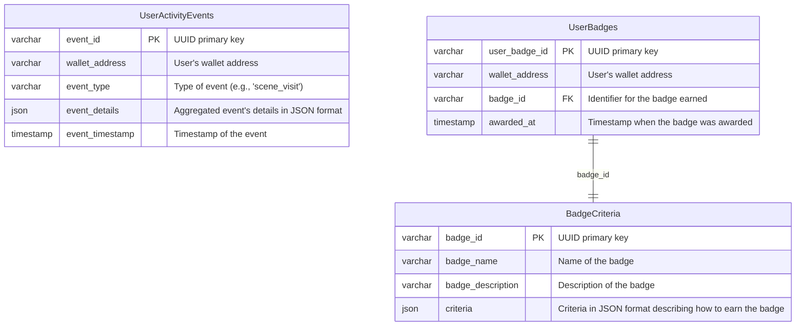

# Badges

## Database design

```mermaid
erDiagram
    UserActivityEvents {
        varchar event_id PK "UUID primary key"
        varchar wallet_address "User's wallet address"
        varchar event_type "Type of event (e.g., 'scene_visit')"
        json event_details "Aggregated event's details in JSON format"
        timestamp event_timestamp "Timestamp of the event"
    }
    BadgeCriteria {
        varchar badge_id PK "UUID primary key"
        varchar badge_name "Name of the badge"
        varchar badge_description "Description of the badge"
        json criteria "Criteria in JSON format describing how to earn the badge"
    }
    UserBadges {
        varchar user_badge_id PK "UUID primary key"
        varchar wallet_address "User's wallet address"
        varchar badge_id FK "Identifier for the badge earned"
        timestamp awarded_at "Timestamp when the badge was awarded"
    }

    UserBadges ||--|| BadgeCriteria : "badge_id"
```