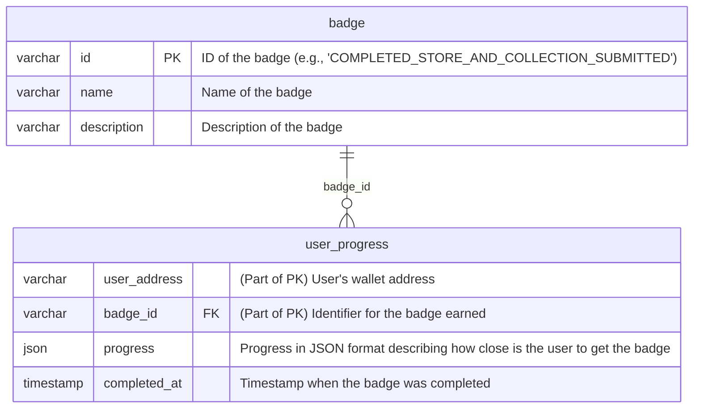

# Badges

## Database Design

```mermaid
erDiagram
    user_progress {
        varchar user_address "(Part of PK) User's wallet address"
        varchar badge_id FK "(Part of PK) Identifier for the badge earned"
        json progress "Progress in JSON format describing how close is the user to get the badge"
        timestamp completed_at "Timestamp when the badge was completed"
    }
    badge {
        varchar id PK "ID of the badge (e.g., 'COMPLETED_STORE_AND_COLLECTION_SUBMITTED')"
        varchar name "Name of the badge"
        varchar description "Description of the badge"
    }

    badge ||--o{ user_progress : "badge_id"
```
